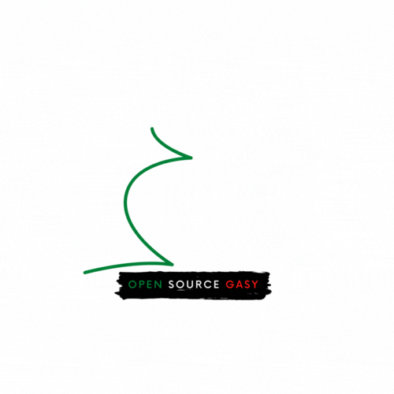

# Open Source Gasy - OpenMG

## About

Open MG is a community of Malagasy developer and open source enthousiats. We are working on open source projects and we are sharing our knowledge with the community.

## Projects

The projects are listed in the [projects](projects.md) page.

## How to contribute

You can contribute to the projects by opening issues or pull requests. You can also contribute by sharing your knowledge with the community.

## How to join

You can join the community by opening an issue in the [community]() repository.

## Members

- [Chrys Rakotonimanana](https://github.com/chrys-elrak)
